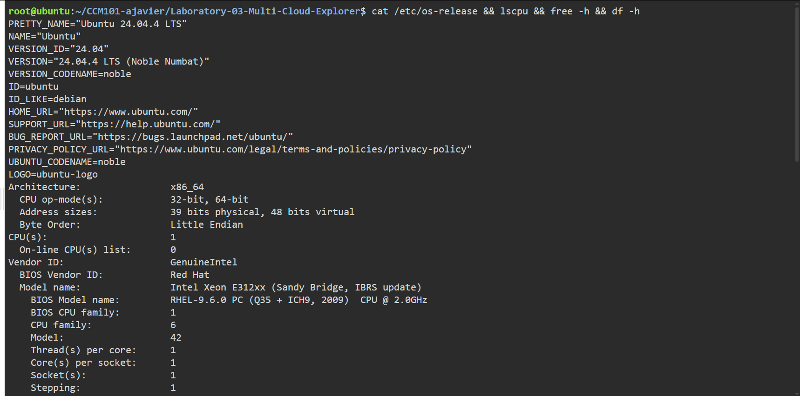
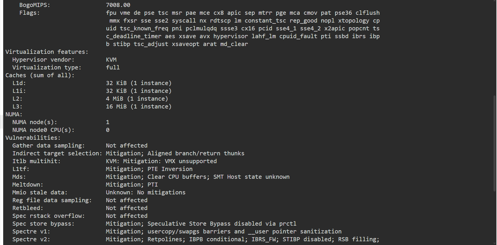
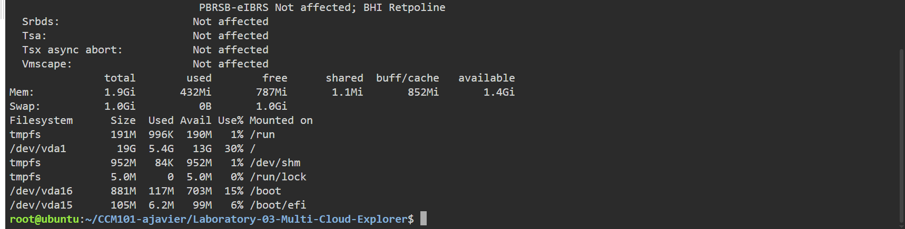

# 🔍 Continue Your Linux Investigation

---

## 🔍 Linux Investigation Results

### System Specifications Matrix

| System Component | Detected Configuration / Metric | Linux Command Used |
| :--- | :--- | :--- |
| **Operating System** | Ubuntu 24.04.4 LTS (Noble Numbat) | `cat /etc/os-release` |
| **CPU Architecture** | x86_64, 1 vCPU (Intel Xeon E312xx @ 2.0GHz, KVM Hypervisor) | `lscpu` |
| **System Memory (RAM)** | 1.9 GiB Total (432 MiB Used, 787 MiB Free, 1.4 GiB Available) | `free -h` |
| **Disk Space** | 19 GiB Root Partition `/dev/vda1` (5.4 GiB Used, 13 GiB Available - 30% Utilization) | `df -h` |

### Cloud Migration Host Services
*If this Linux server were migrated to the cloud, the following services could host it:*

* **AWS (Amazon Web Services):** **Amazon EC2** *(Elastic Compute Cloud)* – A `t3.small` or `t4g.small` instance providing 1 vCPU and 2 GiB RAM on General Purpose SSD (gp3) EBS storage.
* **Microsoft Azure:** **Azure Virtual Machines** – A `Standard_B1ms` or `Standard_B2s` burstable virtual machine running Ubuntu Linux.
* **GCP (Google Cloud Platform):** **Google Compute Engine (GCE)** – An `e2-small` instance (1 vCPU, 2 GB RAM) hosted on Google Cloud.

### Terminal Output Reference

