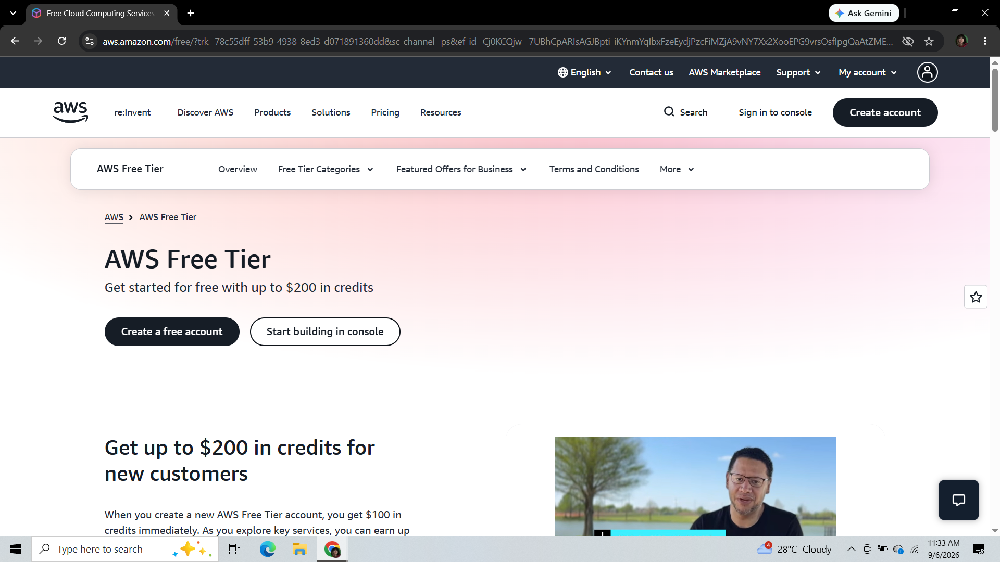

# ☁️ Explore the Three Cloud Platforms: Amazon Web Services (AWS)

---

## 📌 Brief Overview
Amazon Web Services (AWS) is a comprehensive, evolving cloud computing platform provided by Amazon. Launched in 2006, AWS is the pioneer of public cloud services, offering over 200 fully featured services from data centers globally.

---

## 🌍 Global Infrastructure
AWS operates an extensive global infrastructure designed for high availability and performance:
* **AWS Regions:** Geographically isolated physical locations across the globe (over 30+ regions).
* **Availability Zones (AZs):** Each region consists of multiple, isolated, and physically separate AZs with independent power, cooling, and physical security.
* **Edge Locations:** A massive network of global Point of Presence (PoP) sites delivering content via Amazon CloudFront with ultra-low latency.

---

## 🖥️ Cloud Management Console
The **AWS Management Console** is a web-based graphical user interface that provides access to manage AWS resources. Key console functionalities include:
* Centralized search bar for quick navigation to services and resources.
* Configurable dashboards for resource health monitoring and cloud billing tracking.
* CloudShell integration providing direct browser-based CLI access.

---

## 🛠️ Core Services

| Service Category | AWS Service Name | Core Functionality |
| :--- | :--- | :--- |
| **Compute** | **Amazon EC2** *(Elastic Compute Cloud)* | Scalable virtual servers providing secure and resizable compute capacity in the cloud. |
| **Storage** | **Amazon S3** *(Simple Storage Service)* | Highly durable object storage service designed to store and retrieve any amount of data. |
| **Networking** | **Amazon VPC** *(Virtual Private Cloud)* | Isolated virtual network environment to launch AWS resources in a custom network boundary. |
| **Identity** | **AWS IAM** *(Identity & Access Management)* | Centralized service to control user access, credentials, and fine-grained permissions. |

---

## 💡 Key Advantages
* **First-Mover Market Leadership:** Offers the most mature, feature-rich cloud ecosystem with extensive third-party integrations.
* **Unmatched Scalability:** Easily scales computing capacity up or down on demand to handle dynamic traffic spikes.
* **Massive Community & Support:** Extensive documentation, global community forums, and well-architected framework patterns.

---

## 🎯 Typical Enterprise Use Cases
1. **Large-Scale Web Applications:** Hosting resilient, auto-scaling web architectures using EC2, ALB, and S3.
2. **Big Data & Analytics:** Running complex analytics processing pipelines using AWS EMR and Redshift data warehousing.
3. **Enterprise Disaster Recovery:** Maintaining cost-effective cloud backup and failover targets across multiple global regions.

---

## 📸 Platform Evidence

