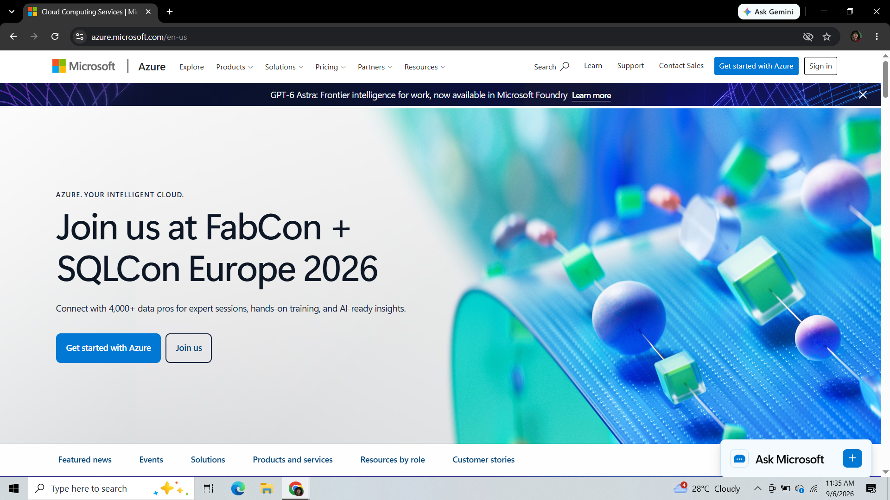

# ☁️ Explore the Three Cloud Platforms: Microsoft Azure

---

## 📌 Brief Overview
Microsoft Azure is a premier public cloud platform created by Microsoft in 2010. It is designed to build, run, and manage applications across multiple clouds with customized, enterprise-grade tools and frameworks.

---

## 🌍 Global Infrastructure
Azure boasts one of the largest global datacenter footprints in the industry:
* **Global Regions:** Over 60+ regions worldwide, available in more than 140 countries.
* **Availability Zones:** Physically separate locations within an Azure region featuring redundant power, networking, and cooling.
* **Geographies:** Defined boundaries containing at least one region to meet data residency and compliance limits.

---

## 🖥️ Cloud Management Console
The **Azure Portal** is a unified, browser-based administrative dashboard that enables resource management:
* Customized dashboards allowing engineers to pin resource monitoring widgets.
* Integrated Azure Cloud Shell supporting both Bash and PowerShell environments.
* Deep Resource Group integration for grouping billing and governance objects together.

---

## 🛠️ Core Services

| Service Category | Azure Service Name | Core Functionality |
| :--- | :--- | :--- |
| **Compute** | **Azure Virtual Machines** | On-demand, scalable virtualized computing resources with full OS control. |
| **Storage** | **Azure Blob Storage** | Massive unstructured object storage optimized for serving document files, video, and backups. |
| **Networking** | **Azure Virtual Network (VNet)** | Provisioning private, isolated networks for secure inter-service communication. |
| **Identity** | **Microsoft Entra ID** *(formerly Azure AD)* | Cloud-based identity and access management service supporting SSO and MFA. |

---

## 💡 Key Advantages
* **Seamless Microsoft Integration:** Unmatched synergy for enterprises using Windows Server, Active Directory, and SQL Server.
* **Hybrid Cloud Dominance:** Industry-leading hybrid infrastructure capabilities through Azure Arc and Azure Stack.
* **Flexible Licensing Discounts:** Cost savings when transferring existing Microsoft enterprise software licenses to the cloud.

---

## 🎯 Typical Enterprise Use Cases
1. **Hybrid Enterprise Migration:** Extending local corporate Active Directory environments smoothly into the cloud.
2. **Enterprise Database Modernization:** Migrating legacy SQL databases to managed Azure SQL Database instances.
3. **DotNet / C# App Development:** Seamless CI/CD hosting for Windows and .NET application stacks via Azure App Services.

---

## 📸 Platform Evidence

