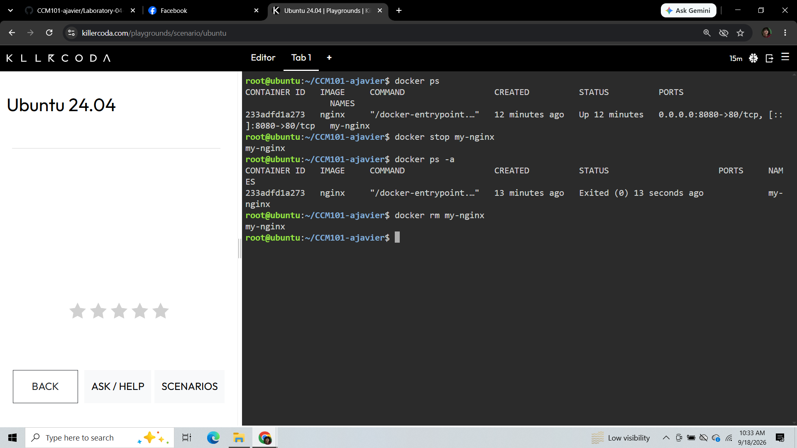

#  The Container Lifecycle

---

###  Container Lifecycle Commands

1. **`docker ps`**
   * *Explanation:* Lists all currently active and running containers along with their IDs, names, and port mappings.

2. **`docker stop my-nginx`**
   * *Explanation:* Gracefully stops the running container named `my-nginx` by sending a `SIGTERM` signal to its primary process.

3. **`docker ps -a`**
   * *Explanation:* Displays all containers on the host system, including active, paused, and exited/stopped containers.

4. **`docker rm my-nginx`**
   * *Explanation:* Permanently deletes the stopped `my-nginx` container instance and frees up system resource references.

---

###  Verification Evidence

